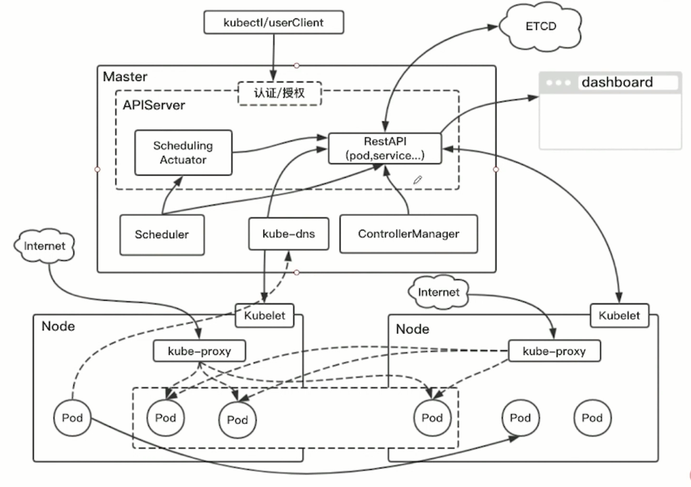
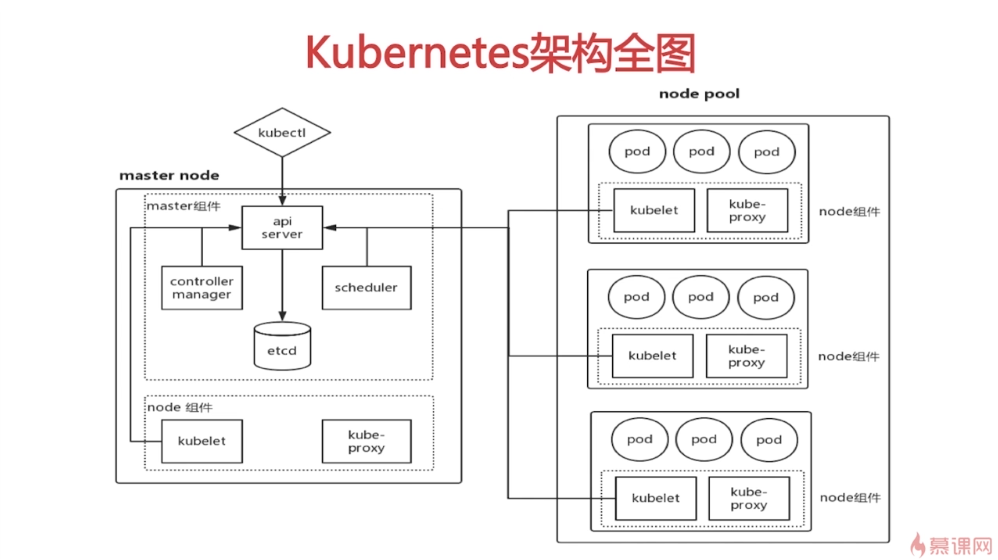

==============
 k8s 架构组成
==============

Master 节点

  APIServer

  Scheduler

  RestAPI

  ETCD

  ControllerManager

  Deployment

    Pod

    Service

Node 节点

  kubelet

  Service

    Pod 最小单元

      docker

        containerized app

        volume

k8s 网络   CNI 窗器网络接口

  Flannel

  Calico

  Weave

  Pod 网络

k8s 调度器

  - preselect 预选规则

    - NodiskConflict

    - CheckNodeMemoryPressure 检查节点内存压力

    - NodeSelector 节点选择

    - FitResource 资源适应

    - Affinity  亲和性

  - optimize-select 优先规则

    - SelectorSpreadPriority

    - LeastRequestedPriority

    - AffinityPriority

	   

	   
