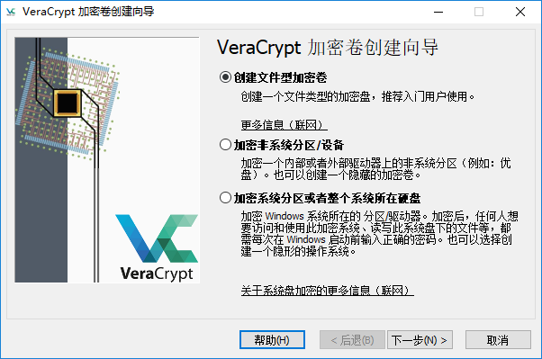

VeraCrypt 加密软件
======================================================================

由于某此原因, TrueCrypt 无法继续使用 [#]_ , 它的替代品 VeraCrypt 还不错;

VeraCrypt 是从 TrueCrypt 派生出来的开源项目, 成立于2013年6月;

获取 windows 版本 `VeraCrypt`_ ;

创建加密卷的过程
------------------------------------------------------------

这是一张软件主界面截图;

.. image:: /kali/basic_tool/image/veracrypt_main.png

点击 **创建加密卷** 进行加密卷创建向导;

- 加密对象的选择

  - 创建文件型加密卷
  - 加密非系统分区 / 设备
  - 加密系统分区或者整个系统所在硬盘

  根据需要选择合适的加密选项;

- 选择加密卷类型

  如下所示, 有两种类型可供选择:

  .. image:: image/veracrypt_volumn_wizard_1.png

  这里着重说一下 **隐藏的 VeraCrypt 加密卷** ;

  这种加密类型主要是考虑到如果有人知道你有此加密卷并强迫你解开密码的情况,

- 选择加密卷位置

  .. image:: image/veracrypt_volumn_wizard_position.png

  这里可以选择已经创建好了的加密卷(如果你想把它当作外层加密卷的话), 或者新建加密卷;

- 选择加密算法

  .. image:: image/veracrypt_volumn_wizard_crypt_option.png

  可以使用单一的加密算法, 也可使用强度更高的组合算法

- 填写加密卷大小

  这项设置不用多说, 加密卷容量越大, 加密耗时越长, 并且加密时可能会出现界面假死的情况;

- 填写加密卷密码

  此密码用于以后你打开加密卷时使用, 可以单独使用密码或密钥文件, 或二者同时使用;

  如果只使用密钥文件进行加密, 那么在挂载时, 选择密钥文件后, 勾先上 **首先尝试以空密码挂载** ,
  不然将会报错密码或密钥错误;

  PIM 选项不明白的话, 勾上后下一步会有更详细的说明;

- 加密卷格式化

  .. image:: image/veracrypt_volumn_wizard_format.png

  这里可以选择格式化的文件系统不多, NTFS, FAT, exFAT, ReFS, 这几种;

  根据需要选择簇的大小, 没有特殊需求的就默认;

  硬盘容量不算窘迫的人, 不要勾选动态加密卷, 根据介绍, 其加密性能低于常规加密;

  在随机缓冲的过程中, 移动鼠标将加快密钥生成速度;

  点击格式化后, 根据加密卷大小, 创建速度不大相同, 完成后点退出, 或选择下一步, 再创建一个加密卷;

.. rubric:: Footnotes
.. [#]
   官网只能下载用于解密的版本, 不怕有后门, 也可以去其它站点下载使用;
.. _VeraCrypt: https://launchpad.net/veracrypt/trunk/1.22/+download/VeraCrypt%20Setup%201.22.exe
