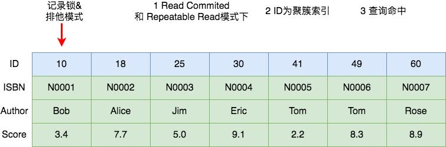
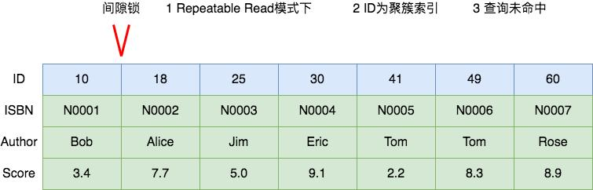
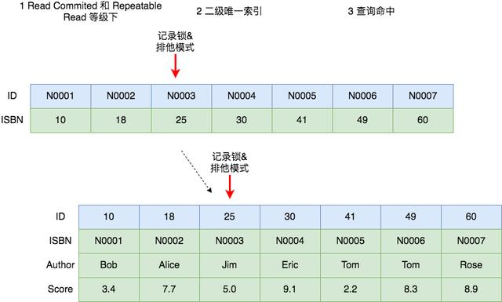
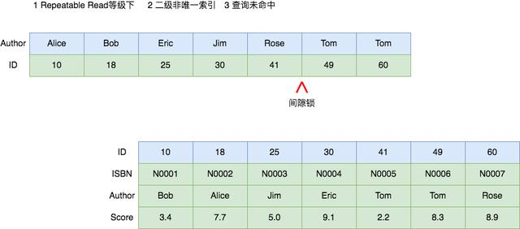
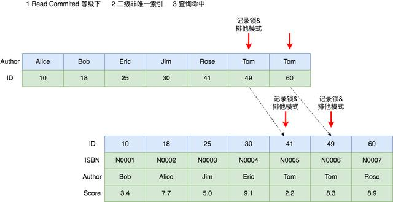
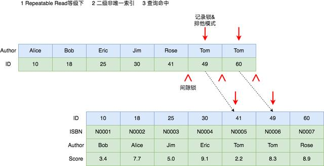
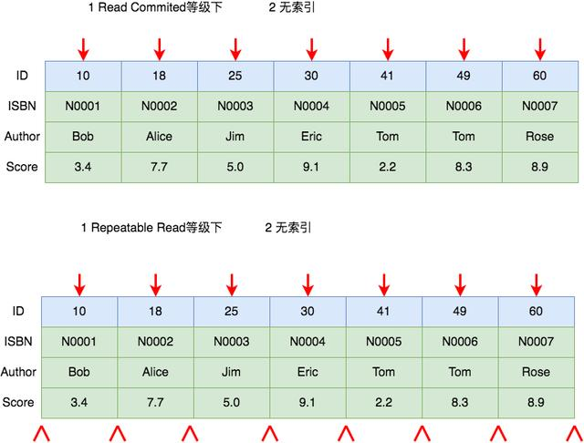
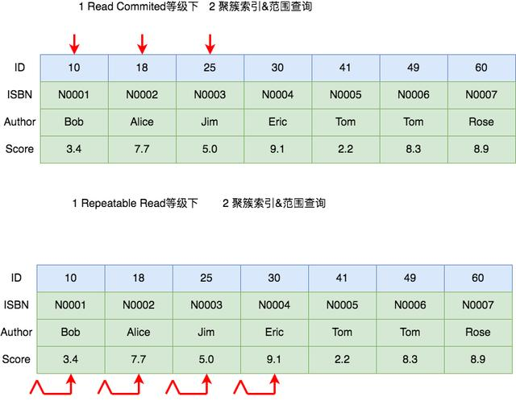
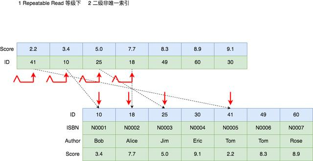
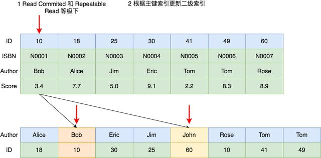

.. _Analysis_of_common_lock_expample:

==================
 常见加锁场景分析
==================

具体 SQL 场景分析主要借鉴何登成前辈的 <<MySQL 加锁处理分析>>文章和
aneasystone 的系列文章, 在他们的基础上进行了总结和整理;

我们使用下面这张 book 表作为实例, 其中 id 为主键, ISBN ( 书号 ) 为二级唯一索引,
Authord (（ 作者 ) 为二级非唯一索引, score ( 评分 ) 无索引;

.. table::  books
   :widths: auto
   :align: center
   :name: booktest
            
   ===== ===== ====== =====
   ID    ISBN  AUTHOR SCORE
   10    N0001 Bob    3.4
   18    N0002 Alice  7.7
   ===== ===== ====== =====
   
UPDATE 语句加锁分析
===================

:ref:`哈<booktest>`

先来分析 UPDATE 相关 SQL 在使用较为简单 where 从句情况下加锁情况.

其中的分析原则也适用于 UPDATE, DELETE 和 SELECT ... FOR UPDATE 等当前读的语句.

聚簇索引, 查询命中
==================

聚簇索引就是 InnoDB 存储引擎下的主键索引, 具体可参考 < MySQL索引 >;

下图展示了使用 ``UPDATE book SET score = 9.2 WHERE ID = 10``
语句 **命中** 的情况下在 RC 和 RR 隔离等级下的加锁, 两种隔离等级下没有任何区别,
都是对 ID = 10 这个索引加 **排他记录锁**;

聚簇索引, 查询未命中
====================

下图展示了 ``UPDATE book SET score = 9.2 WHERE ID = 16``
语句 **未命中** 时 RR 隔离级别下的加锁情况;

在 RC 隔离等级下, 不需要加锁;
而在 RR 隔离级别会在 ID = 16 前后两个索引之间加上间隙锁;

值得注意的是, 间隙锁和间隙锁之间是互不冲突的,
间隙锁唯一的作用就是为了防止其他事务的插入新行, 导致幻读,
所以加间隙 S 锁和加间隙 X 锁没有任何区别;

二级唯一索引, 查询命中
======================

下图展示了 ``UPDATE book SET score = 9.2 WHERE ISBN = 'N0003'``
在 RC 和 RR 隔离等级下命中时的加锁情况;

在 InnoDB 存储引擎中, 二级索引的叶子节点保存着主键索引的值,
然后再拿主键索引去获取真正的数据行, 所以在这种情况下,
二级索引和主键索引都会加 **排他记录锁**;

二级唯一索引, 查询未命中
========================

下图展示了 ``UPDATE book SET score = 9.2 WHERE ISBN = 'N0008'``
语句在 RR 隔离等级下未命中时的加锁情况, RC 隔离等级下该语句未命中不会加锁;

因为 N0008 大于 N0007, 所以要锁住 ( N0007, 正无穷 ) 这段区间,
而 InnoDB 的索引一般都使用 Suprenum Record 和
Infimum Record 来分别表示记录的上下边界. Infimum 是比该页中任何记录都要小的值,
而 Supremum 比该页中最大的记录值还要大, 这两条记录在创建页的时候就有了,
并且不会删除;

所以, 在 N0007 和 Suprenum Record 之间加了间隙锁;

为什么不在主键上也加 GAP 锁呢? 仔细想想, 留白;

二级非唯一索引, 查询命中
========================

下图展示了 ``UPDATE book SET score = 9.2 WHERE Author = 'Tom'``
语句在 RC 隔离等级下命中时的加锁情况;

可以看到, **在 RC 等级下**, 二级唯一索引和二级非唯一索引的加锁情况是一致的,
都是 **在涉及的二级索引和对应的主键索引上加上排他记录锁**;

在 RR 隔离等级下, 加锁的情况产生了变化.
它不仅对涉及的二级索引和主键索引加了排他记录锁,
还在非唯一二级索引上加了三个间隙锁, 锁住了两个 Tom 索引值相关的三个范围;

.. 此处扯远了

那为什么唯一索引不需要加间隙锁呢? 间隙锁的作用是为了解决幻读,
防止其他事务插入相同索引值的记录,
而唯一索引和主键约束都已经保证了该索引值肯定只有一条记录, 所以无需加间隙锁;

需要注意的是, 上图虽然画着 4 个记录锁, 三个间隙锁,
但是实际上间隙锁和它右侧的记录锁会 **合并成 Next-Key 锁**;

所以实际情况有两个 Next-Key 锁, 一个间隙锁 (Tom60, 正无穷 ) 和两个记录锁;

二级非唯一索引, 查询未命中
==========================

下图展示了 ``UPDATE book SET score = 9.2 WHERE Author = 'Sarah'``
在 RR 隔离等级下未命中的加锁情况, 它会在二级索引 Rose 和 Tom 之间加间隙锁.
而 RC 隔离等级下不需要加锁;

无索引
======

当 Where 从句的条件并不使用索引时, 则会对全表进行扫描,
**在 RC 隔离等级下对所有的数据加排他记录锁**.
**在RR 隔离等级下, 除了给记录加锁, 还会对记录和记录之间加间隙锁**.
和上边一样, 间隙锁会和左侧的记录锁合并成 Next-Key 锁;

下图就是 ``UPDATE book SET score = 9.2 WHERE score = 22``
语句在两种隔离等级下的加锁情况;

聚簇索引, 范围查询
==================

上面介绍的场景都是 where 从句的 **等值查询**, 而范围查询的加锁又是怎么样的呢?

下图是 ``UPDATE book SET score = 9.2 WHERE ID <= 25``
在 RC 和 RR 隔离等级下的加锁情况;

RC 场景下与等值查询类似, 只会在涉及的 ID = 10, ID = 18 和 ID = 25
索引上加排他记录锁;

而在 RR 隔离等级下则有所不同, 它会加上间隙锁,
和对应的记录锁合并称为 Next-Key 锁. 除此之外,
它还会在(25, 30] 上分别加 Next-Key 锁.
这一点是十分特殊的, 具体原因还需要再探究;

二级索引, 范围查询
==================

下图展示了 ``UPDATE book SET ISBN = N0001 WHERE score <= 7.9``
在 RR 级别下的加锁情况;

修改索引值
==========

UPDATE 语句修改索引值的情况可以分开分析.
首先 Where 从句的加锁分析如上文所述, 多了一步 Set 部分的加锁;

下图展示了 ``UPDATE book SET Author = 'John' WHERE ID = 10``
在 RC 和 RR 隔离等级下的加锁情况. 除了在主键 ID 上进行加锁,
还会对二级索引上的 Bob ( 旧值 ) 和 John ( 新值 ) 上进行加锁;

DELETE 语句加锁分析
===================

一般来说, DELETE 的加锁和 SELECT FOR UPDATE 或 UPDATE 并没有太大的差异;

因为, 在 MySQL 数据库中, **执行 DELETE 语句** 其实并没有直接删除记录,
而 **是在记录上打上一个删除标记**, 然后通过后台的一个叫做 `purge` 的线程来清理.
从这一点来看, DELETE 和 UPDATE 确实是非常相像.
事实上, DELETE 和 UPDATE 的加锁也几乎是一样的;

INSERT 语句加锁分析
===================

Insert 语句在两种情况下会加锁:

  - 为了防止幻读, 如果记录之间加有间隙锁, 此时不能 Insert;

  - 如果 Insert 的记录和已有记录造成唯一键冲突, 此时不能 Insert;

除了上述情况, Insert 语句的锁都是隐式锁.
**隐式锁是 InnoDB 实现的一种延迟加锁的机制来减少加锁的数量**;

隐式锁的特点是 **只有在可能发生冲突时才加锁**, 减少了锁的数量.
另外, 隐式锁是针对被修改的 B+Tree 记录, 因此都 **是记录类型的锁**,
**不可能是间隙锁或 Next-Key 类型**;

具体 Insert 语句的加锁流程如下:

  #. 首先对插入的间隙加插入意向锁 ( Insert Intension Locks )
     
     - 如果该间隙已被加上了间隙锁或 Next-Key 锁, 则加锁失败进入等待;
       
     - 如果没有, 则加锁成功, 表示可以插入;

  #. 然后判断插入记录是否有唯一键:

     - 如果有, 则 **进行唯一性约束检查**:

       - 如果不存在相同键值, 则完成插入;

       - 如果存在相同键值, 则判断该键值是否加锁;

         - 如果没有锁,  判断该记录是否被标记为删除;

           - 如果标记为删除:

             说明事务已经提交, 还没来得及 purge;

             这时加 S 锁等待;

           - 如果没有标记删除, 则报 duplicate key 错误;

         - 如果有锁, 说明该记录正在处理 ( 新增, 删除或更新 ),
           且事务还未提交

           加 S 锁等待;

  #. 插入记录并对记录加 X 记录锁;

后记
====

文中讲解的 SQL 语句都是十分简单的, 当 SQL 语句包含多个查询条件时,
加锁的分析过程就往往更加复杂. 我们需要使用 MySQL 相关的工具进行分析,
并且有时甚至需要查询 MySQL 相关的日志信息来了解到底语句加了什么锁
或者为什么产生死锁;

