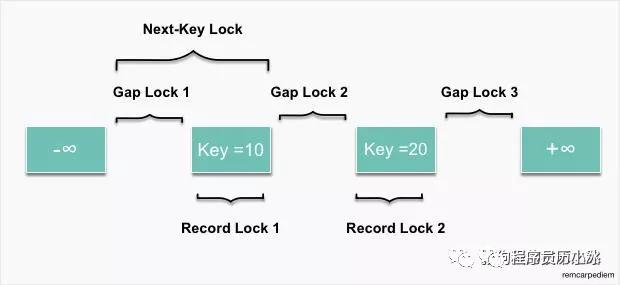

==========
 MySQL 锁
==========

表锁
====

* 说明

  指对一整张表加锁, 一般是 DDL 处理时使用.
  表锁由 MySQL Server 实现, MyISAM 则只能使用 MySQL Server 提供的表锁;

  

* 何时加表锁

  - 在执行 DDL 语句时会对整个表进行加锁, 比如说 ``ALTER TABLE`` 等操作;

  - 也可以明确指定对某个表进行加锁; ``mysql> lock table user read(write)``

* 释放表锁的 3 种情况

  - 使用 ``unlock tables`` 显式释放表锁;

  - 会话持有表锁的情况下, 执行 ``lock table`` 语句, 会释放之前持有的锁;

    渣会话在有锁时, 还去拥有其他锁, 之前的锁就会离他而去;

  - 会话持有表锁, 开启事务时, 会释放之前持有的锁;

行锁
====

锁定某一行或者某几行, 或者行与行之间的间隙;

存储引擎实现, 不同的引擎实现的不同;

InnoDB 支持行锁;

行锁的模式
-----------

锁模式描述的是锁的兼容性, 也就是 **加的是什么锁**, 比如写锁或者读锁;

读写锁
++++++

- 读锁

  又称 **共享锁**, Shark locks, **S 锁**;

  加了读锁的记录, 所有的事务都 **可以读取**, 但是 **不能修改**,
  并且可同时有多个事务对记录加读锁;

- 写锁

  又称 **排他锁**, Exclusive locks, 简称 **X 锁**, 独占锁;

  对记录加了排他锁之后, **只有拥有该锁的事务可以读取和修改**,
  其他事务都不可以读取和修改, 并且 **同一时间只能有一个事务加写锁**
  

读写意向锁
++++++++++

由于表锁和行锁虽然锁定范围不同, 但是会相互冲突.
所以当你要加表锁时, 势必要先遍历该表的所有记录, 判断是否加有排他锁.
MySQL 引入了意向锁, 来 **检测表锁和行锁的冲突**.

意向锁也是表级锁, 可分为:

* 读意向锁 (IS 锁 )

* 写意向锁 (IX 锁 )

当事务在记录上要 **加上读锁或写锁时**, 要 **首先在表上加上意向锁**.
这样判断表中是否有记录加锁就很简单了, 只要看下表上是否有意向锁就行了;

**意向锁之间是不会产生冲突** 的, 也 **不和 AUTO_INC 表锁冲突**,
它 **只会阻塞表级读锁或表级写锁**.

另外, 意向锁也不会和行锁冲突, **行锁只会和行锁冲突**

自增锁
++++++

是一种表锁, 又叫 AUTOINC, 当表中 **有自增列 (AUTOINCREMENT) 时出现**;

当插入表中有自增列时, 数据库需要自动生成自增值,
它会先为该表 **加 AUTOINC 表锁**, **阻塞其他事务的插入** 操作,
这样 **保证生成的自增值是唯一的** ;

特点:

* AUTO_INC 锁互不兼容; 也就是说 **同一张表同时只允许有一个自增锁**

* 自增值一旦分配了就会 +1;

  **如果事务回滚, 自增值也不会减回去**, 所以自增值可能会出现中断的情况;

* AUTOINC 表锁会导致并发插入的效率降低;

  为了提高插入的并发性, MySQL 从 5.1.22 版本开始,
  引入了一种可选的轻量级锁 (mutex) 机制来代替 AUTOINC 锁,
  可以通过参数 **innodbautoinclockmode** 来灵活控制分配自增值时的并发策略;

不同模式锁的兼容矩阵
++++++++++++++++++++

总结:

* 意向锁之间互不冲突;
* S 锁只和 S/IS 锁兼容, 和其他锁都冲突;
* X 锁和其他所有锁都冲突;
* AI 锁只和意向锁兼容;

行锁的类型
----------

锁的类型是指 **锁的粒度** 或者 **锁具体加在什么地方**, 分为:

#. Next-Key Lock -> 锁住 **记录和记录之前** 的间隙

#. Gap Lock 间隙锁 -> 锁住 **记录和记录之间** 的间隔

#. Record Lock 记录锁 -> 只锁住对应的记录

#. 插入意向 GAP 锁;

  
记录锁
++++++

记录锁是最简单的行锁, 只锁住对应的记录;

- 何时加记录锁

  当 SQL 语句 **无法使用索引** 时, 会进行 **全表扫描**.

  这个时候 MySQL 会给整张表的 **所有数据行加记录锁**,
  再由 MySQL **Server 层进行过滤**. 但是，在 MySQL Server 层进行过滤的时候,
  如果发现 **不满足 WHERE 条件**, 会 **释放对应记录的锁**.
  这样做, **保证了最后只会持有满足条件记录上的锁**,
  但是每条记录的加锁操作还是不能省略的;

  所以更新操作必须要根据索引进行操作, 没有索引时, 不仅会消耗大量的锁资源,
  增加数据库的开销, 还会极大的降低了数据库的并发性能;

间隙锁
++++++

- 是一种加在两个索引之间的锁; 或者加在第一个索引之前; 或最后一个索引之后的间隙;

- 可以跨一个索引记录, 多个索引记录, 甚至是空的;

- 防幻读

  使用间隙锁可以防止其他事务在这个范围内插入或修改记录,
  保证两次读取这个范围内的记录不会变, 从而不会出现 **幻读** 现象;

- 注意

  * 间隙锁和间隙锁之间是互不冲突的

  * 间隙锁唯一的作用就是为了防止其他事务的插入,
    所以加间隙 S 锁和加间隙 X 锁没有任何区别;

- 如果 id = 49 记录不存在, SQL 语句还会加锁吗?

  答案是 可能有, 这 **取决于数据库的隔离级别**.

  这种情况下, 在 RC 隔离级别不会加任何锁,
  在 RR 隔离级别会在 id = 49 前后两个索引之间加上间隙锁;

Next-Key 锁
+++++++++++

是记录锁和间隙锁的组合, 指的是 **加在某条记录以及这条记录前面间隙上的锁**

假设一个索引包含 15, 18, 20, 30, 49, 50 这几个值, 可能的 Next-key 锁如下

::

   (--, 15], (15, 18], (18, 20], (20, 30], (30, 49], (49, 50], (50, ++)
   // --, ++ 分别表示负和正的无穷;

   
通常用这种左开右闭区间来表示 Next-key 锁;
圆括号表示不包含该记录, 方括号表示包含该记录;

前面四个都是 Next-key 锁, 最后一个为间隙锁,
和间隙锁一样, 在 RC 隔离级别下没有 Next-key 锁, 只有 RR 隔离级别才有;

例如:

如果 id 不是主键, 而是二级索引, 且不是唯一索引,
那么这个 SQL id = 49 在 RR 隔离级别下就会加如下的 Next-key 锁 (30, 49](49, 50)

此时如果插入一条 id = 31 的记录将会阻塞住.
之所以要把 id = 49 前后的间隙都锁住, 仍然是为了解决幻读问题,
因为 id 是非唯一索引, 所以 id = 49 可能会有多条记录,
为了防止再插入一条 id = 49 的记录;

插入意向锁
++++++++++

是一种特殊的间隙锁, 简写成 II GAP, 表示插入的意向,
只有在 INSERT 的时候才会有这个锁;

**插入意向锁和插入意向锁之间互不冲突**,
所以可以在同一个间隙中有多个事务同时插入不同索引的记录.

譬如 id = 30 和 id = 49 之间如果有两个事务要同时分别插入
id = 32 和 id = 33 是没问题的,
虽然两个事务都会在 id = 30 和 id = 50 之间加上插入意向锁, 但是不会冲突;

**插入意向锁只会和间隙锁或 Next-key 锁冲突**,
正如上面所说, **间隙锁唯一的作用就是防止其他事务插入记录造成幻读**,
正是由于在执行 INSERT 语句时需要加插入意向锁，而插入意向锁和间隙锁冲突,
从而阻止了插入操作的执行;

不同类型锁的兼容矩阵
++++++++++++++++++++

其中, 第一行表示已有的锁, 第一列表示要加的锁.
插入意向锁较为特殊, 所以我们先对插入意向锁做个总结, 如下:

  - 插入意向锁不影响其他事务加其他任何锁.

    也就是说, 一个事务已经获取了插入意向锁, 对其他事务是没有任何影响的;

  - 插入意向锁与间隙锁和 Next-key 锁冲突.

    也就是说, 一个事务想要获取插入意向锁,
    如果有其他事务已经加了间隙锁或 Next-key 锁, 则会阻塞

其他类型的锁的规则较为简单:

  - 间隙锁不和其他锁 ( 不包括插入意向锁 ) 冲突

  - 记录锁和记录锁冲突, Next-key 锁和 Next-key 锁冲突, 记录锁和 Next-key 锁冲突

常见加锁场景分析
================

:ref:`Analysis_of_common_lock_expample`
