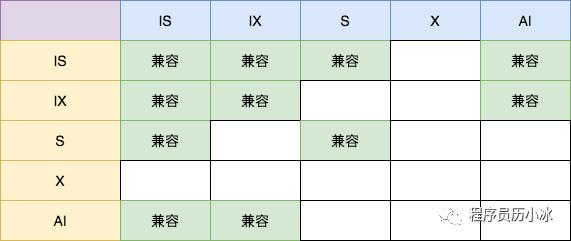
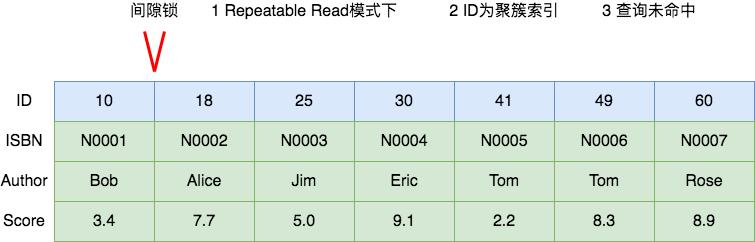
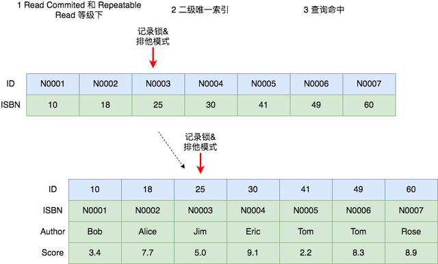
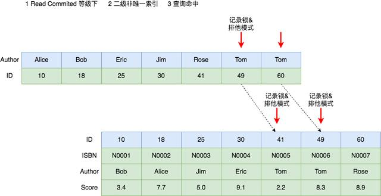
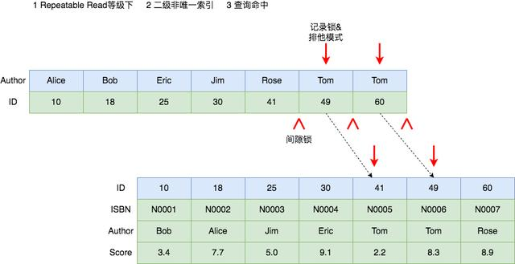
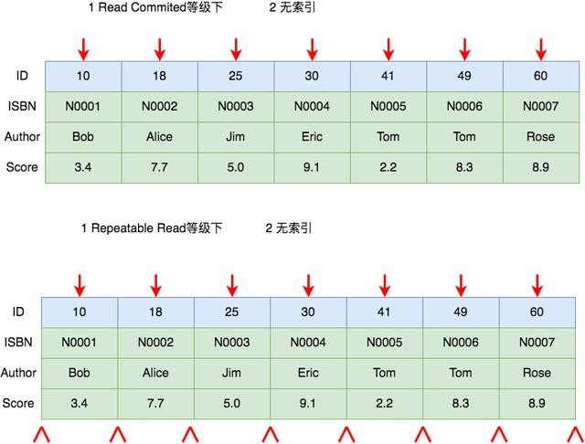
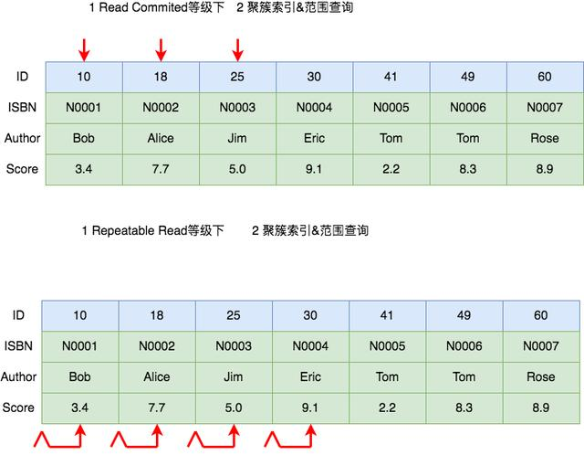
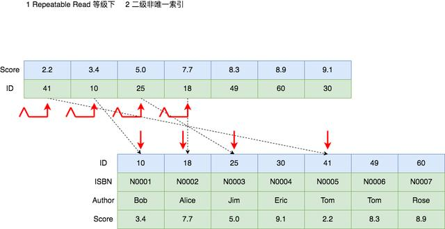
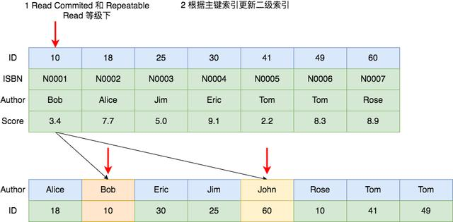

==========
 MySQL 锁
==========

表锁
====

* 说明

  指对一整张表加锁, 一般是 DDL 处理时使用.
  表锁由 MySQL Server 实现, MyISAM 则只能使用 MySQL Server 提供的表锁;

  

* 何时加表锁

  - 在执行 DDL 语句时会对整个表进行加锁, 比如说 ``ALTER TABLE`` 等操作;

  - 也可以明确指定对某个表进行加锁; ``mysql> lock table user read(write)``

* 释放表锁的 3 种情况

  - 使用 ``unlock tables`` 显式释放表锁;

  - 会话持有表锁的情况下, 执行 ``lock table`` 语句, 会释放之前持有的锁;

    渣会话在有锁时, 还去拥有其他锁, 之前的锁就会离他而去;

  - 会话持有表锁, 开启事务时, 会释放之前持有的锁;

行锁
====

锁定某一行或者某几行, 或者行与行之间的间隙;

存储引擎实现, 不同的引擎实现的不同;

InnoDB 支持行锁;

行锁的模式
-----------

锁模式描述的是锁的兼容性, 也就是 **加的是什么锁**, 比如写锁或者读锁;

读写锁
++++++

- 读锁

  又称 **共享锁**, Shark locks, **S 锁**;

  加了读锁的记录, 所有的事务都 **可以读取**, 但是 **不能修改**,
  并且可同时有多个事务对记录加读锁;

- 写锁

  又称 **排他锁**, Exclusive locks, 简称 **X 锁**, 独占锁;

  对记录加了排他锁之后, **只有拥有该锁的事务可以读取和修改**,
  其他事务都不可以读取和修改, 并且 **同一时间只能有一个事务加写锁**
  

读写意向锁
++++++++++

由于表锁和行锁虽然锁定范围不同, 但是会相互冲突.
所以当你要加表锁时, 势必要先遍历该表的所有记录, 判断是否加有排他锁.
MySQL 引入了意向锁, 来 **检测表锁和行锁的冲突**.

意向锁也是表级锁, 可分为:

* 读意向锁 (IS 锁 )

* 写意向锁 (IX 锁 )

当事务在记录上要 **加上读锁或写锁时**, 要 **首先在表上加上意向锁**.
这样判断表中是否有记录加锁就很简单了, 只要看下表上是否有意向锁就行了;

**意向锁之间是不会产生冲突** 的, 也 **不和 AUTO_INC 表锁冲突**,
它 **只会阻塞表级读锁或表级写锁**.

另外, 意向锁也不会和行锁冲突, **行锁只会和行锁冲突**

自增锁
++++++

是一种表锁, 又叫 AUTOINC, 当表中 **有自增列 (AUTOINCREMENT) 时出现**;

当插入表中有自增列时, 数据库需要自动生成自增值,
它会先为该表 **加 AUTOINC 表锁**, **阻塞其他事务的插入** 操作,
这样 **保证生成的自增值是唯一的** ;

特点:

* AUTO_INC 锁互不兼容; 也就是说 **同一张表同时只允许有一个自增锁**

* 自增值一旦分配了就会 +1;

  **如果事务回滚, 自增值也不会减回去**, 所以自增值可能会出现中断的情况;

* AUTOINC 表锁会导致并发插入的效率降低;

  为了提高插入的并发性, MySQL 从 5.1.22 版本开始,
  引入了一种可选的轻量级锁 (mutex) 机制来代替 AUTOINC 锁,
  可以通过参数 **innodbautoinclockmode** 来灵活控制分配自增值时的并发策略;

不同模式锁的兼容矩阵
++++++++++++++++++++

总结:

* 意向锁之间互不冲突;
* S 锁只和 S/IS 锁兼容, 和其他锁都冲突;
* X 锁和其他所有锁都冲突;
* AI 锁只和意向锁兼容;

行锁的类型
----------

锁的类型是指 **锁的粒度** 或者 **锁具体加在什么地方**, 分为:

#. Next-Key Lock -> 锁住 **记录和记录之前** 的间隙

#. Gap Lock 间隙锁 -> 锁住 **记录和记录之间** 的间隔

#. Record Lock 记录锁 -> 只锁住对应的记录

#. 插入意向 GAP 锁;

.. image:: images/lock-in-range-of-different-locks.jpg
   :name: 不同类型锁的锁定范围
   :target: https://www.toutiao.com/i6838563153626792451/

  
记录锁
++++++

记录锁是最简单的行锁, 只锁住对应的记录;

- 何时加记录锁

  当 SQL 语句 **无法使用索引** 时, 会进行 **全表扫描**.

  这个时候 MySQL 会给整张表的 **所有数据行加记录锁**,
  再由 MySQL **Server 层进行过滤**. 但是，在 MySQL Server 层进行过滤的时候,
  如果发现 **不满足 WHERE 条件**, 会 **释放对应记录的锁**.
  这样做, **保证了最后只会持有满足条件记录上的锁**,
  但是每条记录的加锁操作还是不能省略的;

  所以更新操作必须要根据索引进行操作, 没有索引时, 不仅会消耗大量的锁资源,
  增加数据库的开销, 还会极大的降低了数据库的并发性能;

间隙锁
++++++

- 是一种加在两个索引之间的锁; 或者加在第一个索引之前; 或最后一个索引之后的间隙;

- 可以跨一个索引记录, 多个索引记录, 甚至是空的;

- 防幻读

  使用间隙锁可以防止其他事务在这个范围内插入或修改记录,
  保证两次读取这个范围内的记录不会变, 从而不会出现 **幻读** 现象;

- 注意

  * 间隙锁和间隙锁之间是互不冲突的

  * 间隙锁唯一的作用就是为了防止其他事务的插入,
    所以加间隙 S 锁和加间隙 X 锁没有任何区别;

- 如果 id = 49 记录不存在, SQL 语句还会加锁吗?

  答案是 可能有, 这 **取决于数据库的隔离级别**.

  这种情况下, 在 RC 隔离级别不会加任何锁,
  在 RR 隔离级别会在 id = 49 前后两个索引之间加上间隙锁;

Next-Key 锁
+++++++++++

是记录锁和间隙锁的组合, 指的是 **加在某条记录以及这条记录前面间隙上的锁**

假设一个索引包含 15, 18, 20, 30, 49, 50 这几个值, 可能的 Next-key 锁如下

::

   (--, 15], (15, 18], (18, 20], (20, 30], (30, 49], (49, 50], (50, ++)
   // --, ++ 分别表示负和正的无穷;

   
通常用这种左开右闭区间来表示 Next-key 锁;
圆括号表示不包含该记录, 方括号表示包含该记录;

前面四个都是 Next-key 锁, 最后一个为间隙锁,
和间隙锁一样, 在 RC 隔离级别下没有 Next-key 锁, 只有 RR 隔离级别才有;

例如:

如果 id 不是主键, 而是二级索引, 且不是唯一索引,
那么这个 SQL id = 49 在 RR 隔离级别下就会加如下的 Next-key 锁 (30, 49](49, 50)

此时如果插入一条 id = 31 的记录将会阻塞住.
之所以要把 id = 49 前后的间隙都锁住, 仍然是为了解决幻读问题,
因为 id 是非唯一索引, 所以 id = 49 可能会有多条记录,
为了防止再插入一条 id = 49 的记录;

插入意向锁
++++++++++

是一种特殊的间隙锁, 简写成 II GAP, 表示插入的意向,
只有在 INSERT 的时候才会有这个锁;

**插入意向锁和插入意向锁之间互不冲突**,
所以可以在同一个间隙中有多个事务同时插入不同索引的记录.

譬如 id = 30 和 id = 49 之间如果有两个事务要同时分别插入
id = 32 和 id = 33 是没问题的,
虽然两个事务都会在 id = 30 和 id = 50 之间加上插入意向锁, 但是不会冲突;

**插入意向锁只会和间隙锁或 Next-key 锁冲突**,
正如上面所说, **间隙锁唯一的作用就是防止其他事务插入记录造成幻读**,
正是由于在执行 INSERT 语句时需要加插入意向锁，而插入意向锁和间隙锁冲突,
从而阻止了插入操作的执行;

不同类型锁的兼容矩阵
++++++++++++++++++++

.. image:: images/compatibility-matrix-in-different-lock-type.jpg
   :alt: 不同类型锁的兼容矩阵.jpg
   :name: 不同类型锁的兼容矩阵

其中, 第一行表示已有的锁, 第一列表示要加的锁.
插入意向锁较为特殊, 所以我们先对插入意向锁做个总结, 如下:

  - 插入意向锁不影响其他事务加其他任何锁.

    也就是说, 一个事务已经获取了插入意向锁, 对其他事务是没有任何影响的;

  - 插入意向锁与间隙锁和 Next-key 锁冲突.

    也就是说, 一个事务想要获取插入意向锁,
    如果有其他事务已经加了间隙锁或 Next-key 锁, 则会阻塞

其他类型的锁的规则较为简单:

  - 间隙锁不和其他锁 ( 不包括插入意向锁 ) 冲突

  - 记录锁和记录锁冲突, Next-key 锁和 Next-key 锁冲突, 记录锁和 Next-key 锁冲突

常见加锁场景分析
================

数据库的 **隔离等级, SQL 语句和当前数据库数据** 会共同影响该条 SQL
执行时数据库生成的锁模式, 锁类型和锁数量;

隔离等级对加锁的影响
--------------------

MySQL 的隔离等级对加锁有影响, 所以在分析具体加锁场景时,
**首先要确定当前的隔离等级**;

  - 读未提交 (Read Uncommitted 后续简称 RU)

    可以读到未提交的读, 基本上不会使用该隔离等级, 所以暂时忽略

  - 读已提交 (Read Committed 后续简称 RC )

    **存在幻读** 问题, **对当前读获取的数据加记录锁**;

  - 可重复读 (Repeatable Read 后续简称 RR)

    不存在幻读问题, **对当前读获取的数据加记录锁**,
    同时 **对涉及的范围加间隙锁**, 防止新的数据插入, 导致幻读;

  - 序列化 (Serializable): 从 MVCC 并发控制退化到基于锁的并发控制,
    不存在快照读, 都是当前读, 并发效率急剧下降, **不建议使用**;

这里说明一下, RC 总是读取记录的最新版本,
而 RR 是读取该记录事务开始时的那个版本, 虽然这两种读取的版本不同,
但是都是快照数据, 并不会被写操作阻塞,
所以这种读操作称为 **快照读** (Snapshot Read)

MySQL 还提供了另一种读取方式叫 **当前读** (Current Read),
它读的不再是数据的快照版本, 而是数据的最新版本, 并会对数据加锁,
根据语句和加锁的不同, 又分成三种情况:

  - SELECT ... LOCK IN SHARE MODE: 加共享 (S) 锁

  - SELECT ... FOR UPDATE: 加排他 (X) 锁

  - INSERT / UPDATE / DELETE: 加排他 (X) 锁

当前读在 RR 和 RC 两种隔离级别下的实现也是不一样的:
RC 只加记录锁, RR 除了加记录锁, 还会加间隙锁, 用于解决幻读问题;

不同 SQL 语句对加锁的影响
-------------------------

不同的 SQL 语句当然会加不同的锁, 总结起来主要分为五种情况:

  - SELECT ... 语句正常情况下为快照读, 不加锁;

  - SELECT ... LOCK IN SHARE MODE 语句为当前读, 加 S 锁;

  - SELECT ... FOR UPDATE 语句为当前读, 加 X 锁;

  - 常见的 DML 语句 ( 如 INSERT, DELETE, UPDATE ) 为当前读, 加 X 锁

  - 常见的 DDL 语句 ( 如 ALTER, CREATE 等 ) 加表级锁,
    且这些语句为 **隐式提交, 不能回滚**;

其中, 当前读的 SQL 语句的 where 从句的不同也会影响加锁,
包括是否使用索引, 索引是否是唯一索引等等;

当前数据对加锁的影响
--------------------

SQL 语句执行时数据库中的数据也会对加锁产生影响;

比如一条最简单的根据主键进行更新的 SQL 语句,
**如果主键存在, 则只需要对其加记录锁, 如果不存在, 则需要在加间隙锁**

具体场景分析
------------

具体 SQL 场景分析主要借鉴何登成前辈的 <<MySQL 加锁处理分析>>文章和
aneasystone 的系列文章, 在他们的基础上进行了总结和整理;

我们使用下面这张 book 表作为实例, 其中 id 为主键, ISBN ( 书号 ) 为二级唯一索引,
Authord (（ 作者 ) 为二级非唯一索引, score ( 评分 ) 无索引;

.. table::  books
   :widths: auto
   :align: center
   :name: books
            
   ===== ===== ====== =====
   ID    ISBN  AUTHOR SCORE
   10    N0001 Bob    3.4
   18    N0002 Alice  7.7
   ===== ===== ====== =====
   
UPDATE 语句加锁分析
+++++++++++++++++++

先来分析 UPDATE 相关 SQL 在使用较为简单 where 从句情况下加锁情况.

其中的分析原则也适用于 UPDATE, DELETE 和 SELECT ... FOR UPDATE 等当前读的语句.

聚簇索引, 查询命中
++++++++++++++++++

聚簇索引就是 InnoDB 存储引擎下的主键索引, 具体可参考 < MySQL索引 >;

下图展示了使用 ``UPDATE book SET score = 9.2 WHERE ID = 10``
语句 **命中** 的情况下在 RC 和 RR 隔离等级下的加锁, 两种隔离等级下没有任何区别,
都是对 ID = 10 这个索引加 **排他记录锁**;

.. image:: images/equal_query_hit_primary_index_X_record_lock.jpg
   :align: center
   :alt: images/equal_query_hit_primary_index_X_record_lock.jpg

聚簇索引, 查询未命中
++++++++++++++++++++

下图展示了 ``UPDATE book SET score = 9.2 WHERE ID = 16``
语句 **未命中** 时 RR 隔离级别下的加锁情况;

在 RC 隔离等级下, 不需要加锁;
而在 RR 隔离级别会在 ID = 16 前后两个索引之间加上间隙锁;

值得注意的是, 间隙锁和间隙锁之间是互不冲突的,
间隙锁唯一的作用就是为了防止其他事务的插入新行, 导致幻读,
所以加间隙 S 锁和加间隙 X 锁没有任何区别;

二级唯一索引, 查询命中
++++++++++++++++++++++

下图展示了 ``UPDATE book SET score = 9.2 WHERE ISBN = 'N0003'``
在 RC 和 RR 隔离等级下命中时的加锁情况;

在 InnoDB 存储引擎中, 二级索引的叶子节点保存着主键索引的值,
然后再拿主键索引去获取真正的数据行, 所以在这种情况下,
二级索引和主键索引都会加 **排他记录锁**;

二级唯一索引, 查询未命中
++++++++++++++++++++++++

下图展示了 ``UPDATE book SET score = 9.2 WHERE ISBN = 'N0008'``
语句在 RR 隔离等级下未命中时的加锁情况, RC 隔离等级下该语句未命中不会加锁;

因为 N0008 大于 N0007, 所以要锁住 ( N0007, 正无穷 ) 这段区间,
而 InnoDB 的索引一般都使用 Suprenum Record 和
Infimum Record 来分别表示记录的上下边界. Infimum 是比该页中任何记录都要小的值,
而 Supremum 比该页中最大的记录值还要大, 这两条记录在创建页的时候就有了,
并且不会删除;

所以, 在 N0007 和 Suprenum Record 之间加了间隙锁;

.. image:: images/equal_query_miss_secondary_unique_index_gap_lock.jpg
   :align: center
   :alt: images/equal_query_miss_secondary_unique_index_gap_lock.jpg

为什么不在主键上也加 GAP 锁呢? 仔细想想, 留白;

二级非唯一索引, 查询命中
++++++++++++++++++++++++

下图展示了 ``UPDATE book SET score = 9.2 WHERE Author = 'Tom'``
语句在 RC 隔离等级下命中时的加锁情况;

可以看到, **在 RC 等级下**, 二级唯一索引和二级非唯一索引的加锁情况是一致的,
都是 **在涉及的二级索引和对应的主键索引上加上排他记录锁**;

在 RR 隔离等级下, 加锁的情况产生了变化.
它不仅对涉及的二级索引和主键索引加了排他记录锁,
还在非唯一二级索引上加了三个间隙锁, 锁住了两个 Tom 索引值相关的三个范围;

.. 此处扯远了

那为什么唯一索引不需要加间隙锁呢? 间隙锁的作用是为了解决幻读,
防止其他事务插入相同索引值的记录,
而唯一索引和主键约束都已经保证了该索引值肯定只有一条记录, 所以无需加间隙锁;

需要注意的是, 上图虽然画着 4 个记录锁, 三个间隙锁,
但是实际上间隙锁和它右侧的记录锁会 **合并成 Next-Key 锁**;

所以实际情况有两个 Next-Key 锁, 一个间隙锁 (Tom60, 正无穷 ) 和两个记录锁;

二级非唯一索引, 查询未命中
++++++++++++++++++++++++++

下图展示了 ``UPDATE book SET score = 9.2 WHERE Author = 'Sarah'``
在 RR 隔离等级下未命中的加锁情况, 它会在二级索引 Rose 和 Tom 之间加间隙锁.
而 RC 隔离等级下不需要加锁;

.. image:: images/equal_query_miss_secondary_unique_index_gap_lock.jpg
   :align: center
   :alt: images/equal_query_miss_secondary_unique_index_gap_lock.jpg

无索引
++++++

当 Where 从句的条件并不使用索引时, 则会对全表进行扫描,
**在 RC 隔离等级下对所有的数据加排他记录锁**.
**在RR 隔离等级下, 除了给记录加锁, 还会对记录和记录之间加间隙锁**.
和上边一样, 间隙锁会和左侧的记录锁合并成 Next-Key 锁;

下图就是 ``UPDATE book SET score = 9.2 WHERE score = 22``
语句在两种隔离等级下的加锁情况;

聚簇索引, 范围查询
++++++++++++++++++

上面介绍的场景都是 where 从句的 **等值查询**, 而范围查询的加锁又是怎么样的呢?

下图是 ``UPDATE book SET score = 9.2 WHERE ID <= 25``
在 RC 和 RR 隔离等级下的加锁情况;

RC 场景下与等值查询类似, 只会在涉及的 ID = 10, ID = 18 和 ID = 25
索引上加排他记录锁;

而在 RR 隔离等级下则有所不同, 它会加上间隙锁,
和对应的记录锁合并称为 Next-Key 锁. 除此之外,
它还会在(25, 30] 上分别加 Next-Key 锁.
这一点是十分特殊的, 具体原因还需要再探究;

二级索引, 范围查询
++++++++++++++++++

下图展示了 ``UPDATE book SET ISBN = N0001 WHERE score <= 7.9``
在 RR 级别下的加锁情况;

修改索引值
++++++++++

UPDATE 语句修改索引值的情况可以分开分析.
首先 Where 从句的加锁分析如上文所述, 多了一步 Set 部分的加锁;

下图展示了 ``UPDATE book SET Author = 'John' WHERE ID = 10``
在 RC 和 RR 隔离等级下的加锁情况. 除了在主键 ID 上进行加锁,
还会对二级索引上的 Bob ( 旧值 ) 和 John ( 新值 ) 上进行加锁;

DELETE 语句加锁分析
+++++++++++++++++++

一般来说, DELETE 的加锁和 SELECT FOR UPDATE 或 UPDATE 并没有太大的差异;

因为, 在 MySQL 数据库中, **执行 DELETE 语句** 其实并没有直接删除记录,
而 **是在记录上打上一个删除标记**, 然后通过后台的一个叫做 `purge` 的线程来清理.
从这一点来看, DELETE 和 UPDATE 确实是非常相像.
事实上, DELETE 和 UPDATE 的加锁也几乎是一样的;

INSERT 语句加锁分析
+++++++++++++++++++

Insert 语句在两种情况下会加锁:

  - 为了防止幻读, 如果记录之间加有间隙锁, 此时不能 Insert;

  - 如果 Insert 的记录和已有记录造成唯一键冲突, 此时不能 Insert;

除了上述情况, Insert 语句的锁都是隐式锁.
**隐式锁是 InnoDB 实现的一种延迟加锁的机制来减少加锁的数量**;

隐式锁的特点是 **只有在可能发生冲突时才加锁**, 减少了锁的数量.
另外, 隐式锁是针对被修改的 B+Tree 记录, 因此都 **是记录类型的锁**,
**不可能是间隙锁或 Next-Key 类型**;

具体 Insert 语句的加锁流程如下:

  #. 首先对插入的间隙加插入意向锁 ( Insert Intension Locks )
     
     - 如果该间隙已被加上了间隙锁或 Next-Key 锁, 则加锁失败进入等待;
       
     - 如果没有, 则加锁成功, 表示可以插入;

  #. 然后判断插入记录是否有唯一键:

     - 如果有, 则 **进行唯一性约束检查**:

       - 如果不存在相同键值, 则完成插入;

       - 如果存在相同键值, 则判断该键值是否加锁;

         - 如果没有锁,  判断该记录是否被标记为删除;

           - 如果标记为删除:

             说明事务已经提交, 还没来得及 purge;

             这时加 S 锁等待;

           - 如果没有标记删除, 则报 duplicate key 错误;

         - 如果有锁, 说明该记录正在处理 ( 新增, 删除或更新 ),
           且事务还未提交

           加 S 锁等待;

  #. 插入记录并对记录加 X 记录锁;

后记
++++

文中讲解的 SQL 语句都是十分简单的, 当 SQL 语句包含多个查询条件时,
加锁的分析过程就往往更加复杂. 我们需要使用 MySQL 相关的工具进行分析,
并且有时甚至需要查询 MySQL 相关的日志信息来了解到底语句加了什么锁
或者为什么产生死锁;

