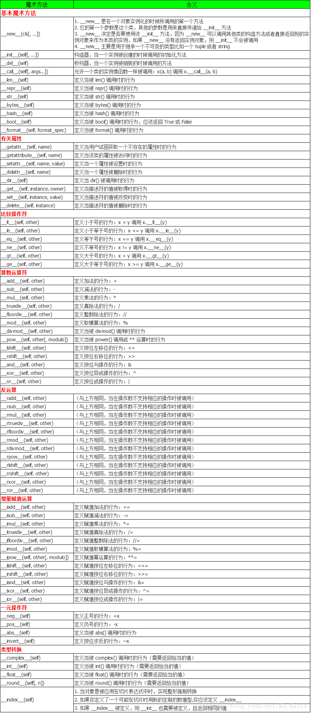

======================================================================
python3的内置
======================================================================

特殊变量
------------------------------------------------------------

#. **__all__**

   python 模块中的 __all__, 可用于模块导入时限制, 如: ``from module import *``,
   此时被导入模块若定义了 __all__ 属性, 则只有__all__内指定的属性, 方法, 类可被导入.
   若没定义, 则导入模块内的所有公有属性, 方法和类;

#. **__file__**

   文件所在的路径

   ::

      import os
      print(os.__file__)

#. **__name__**

   一个模块被另一个程序第一次引入时, 其主程序将运行.
   如果我们想在模块被引入时, 模块中的某一程序块不执行,
   我们可以用 __name__ 属性来使该程序块仅在该模块自身运行时执行;

   当模块自己运行时, 其 __name__ 属性的值为 "__main__"

   ::

      #!/usr/bin/python3
      # Filename: using_name.py
 
      if __name__ == '__main__':
          print('程序自身在运行')
      else:
          print('我来自另一模块')

#. **__package__**

   当前包的包名

#. **__slots__**

   Python 允许在定义 class 的时候, 定义一个特殊的 __slots__ 变量,
   来限制该 class 实例能添加的属性.

   ::

      class Person(object):
          # __slots__ = ["name", "age"] # 效果相同
          __slots__ = ("name", "age")

      此类只允许有 name 与 age 属性, 额外添加会引发 AttributeError 异常;

特殊参数
------------------------------------------------------------

魔术方法
------------------------------------------------------------

- 跟运算符无关的特殊方法

  ======================== ===========================================
  类别                     方法名
  ======================== ===========================================
  字符串/字节序列表示形式  __repr__, __str__, __format__, __bytes__
  数值转换                 __abs__, __bool__, __complex__, __int__, __float__, __hash__, __index__
  集合模拟                 __len__, __getitem__, __setitem__, __delitem__, __contains__
  迭代枚举                 __iter__, __reversed__, __next__
  可调用模拟               __call__
  上下文管理               __enter__, __exit__
  实例创建和销毁           __new__, __init__, __del__
  属性管理                 __getattr__, __getattribute__, __setattr__, __delattr__, __dir__
  属性描述符               __get__, __set__, __delete__
  跟类相关的服务           __prepare__, __instancecheck__, __subclasscheck__
  ======================== ===========================================

- 跟运算符相关的特殊方法

  +------------+-----------------------------------------------------------------------------+
  | 类别       | 方法名和对应的运算符                                                        |
  +============+=============================================================================+
  | 一元运算符 | __neg__ -, __pos__ +, __abs__ abs()                                         |
  +------------+-----------------------------------------------------------------------------+
  | 比较运算符 | __lt__ <, __le__ <=, __eq__ ==, __ne__ !=, __gt__ >, __ge__ >=              |
  +------------+-----------------------------------------------------------------------------+
  | 算术运算符 | __add__ +, __sub__ -, __mul__ *, __truediv__ /, __floordiv__ //, __mod__ %, |
  |            | __divmod__ divmod(), __pow__ ** 或pow(), __round__ round()                  |
  +------------+-----------------------------------------------------------------------------+
  | 反向算术   | __radd__, __rsub__, __rmul__, __rtruediv__, __rfloordiv__,                  |
  | 运算符     | __rmod__, __rdivmod__, __rpow__                                             |
  +------------+-----------------------------------------------------------------------------+
  | 增量赋值   | __iadd__, __isub__, __imul__, __itruediv__,                                 |
  | 算术运算符 | __ifloordiv__, __imod__, __ipow__                                           |
  +------------+-----------------------------------------------------------------------------+
  | 位运算符   | __invert__ ~, __lshift__ <<, __rshift__ >>, __and__ &, __or__ \|, __xor__ ^ |
  +------------+-----------------------------------------------------------------------------+
  | 反向       | __rlshift__、__rrshift__、__rand__、__rxor__、__ror__                       |
  | 位运算符   |                                                                             |
  +------------+-----------------------------------------------------------------------------+
  | 增量赋值   | __ilshift__, __irshift__, __iand__, __ixor__, __ior__                       |
  | 位运算符   |                                                                             |
  +------------+-----------------------------------------------------------------------------+

python 自定义属性访问
++++++++++++++++++++++++++++++++++++++++++++++++++

python 自定义属性访问 __setattr__, __getattr__,__getattribute__, __call__

- **object._getattr_(self, name)**

  实例 instance 通过 instance.name 访问属性 name,
  只有当属性 name 没有在实例的 __dict__ 或它构造类的 __dict__ 或基类的 __dict__ 中没有找到，
  才会调用 ``__getattr__``. 当属性name可以通过正常机制追溯到时,
  __getattr__ 是不会被调用的. 
  如果在 ``__getattr__(self, attr)`` 存在通过self.attr访问属性，会出现无限递归错误;

  ::

     class ClassA(object):

         def __init__(self, classname):
             self.classname = classname

	 def __getattr__(self, attr):
             return('invoke __getattr__', attr)

     insA = ClassA('ClassA')
     print(insA.__dict__) # 实例insA已经有classname属性了
     # {'classname': 'ClassA'}

     print(insA.classname) # 不会调用__getattr__
     # ClassA

     print(insA.grade) # grade属性没有找到，调用__getattr__
     # ('invoke __getattr__', 'grade')

- **object.__getattribute__(self, name)**

  实例 instance 通过 instance.name 访问属性 name,
  ``__getattribute__`` 方法一直会被调用, 无论属性 name 是否追溯到.
  如果类还定义了 ``__getattr__`` 方法，除非通过 ``__getattribute__`` 显式的调用它,
  或者 ``__getattribute__`` 方法出现 **AttributeError** 错误,
  否则 ``__getattr__`` 方法不会被调用了.
  如果在 ``__getattribute__(self, attr)`` 方法下存在通过 self.attr 访问属性,
  会出现无限递归错误. 如下所示, ClassA 中定义了 __getattribute__ 方法,
  实例 insA 获取属性时都会调用 __getattribute__ 返回结果, 即使是访问 __dict__ 属性

  ::

     class ClassA(object):

         def __init__(self, classname):
	     self.classname = classname

         def __getattr__(self, attr):
             return('invoke __getattr__', attr)

         def __getattribute__(self, attr):
             return('invoke __getattribute__', attr)

     insA = ClassA('ClassA')
     print(insA.__dict__)
     # ('invoke __getattribute__', '__dict__')
     
     print(insA.classname)
     # ('invoke __getattribute__', 'classname')
     
     print(insA.grade)
     # ('invoke __getattribute__', 'grade')

- **object.__setattr__(self, name, value)**

  如果类自定义了 ``__setattr__`` 方法, 当通过实例获取属性尝试赋值时,
  就会调用 ``__setattr__``. 常规的对实例属性赋值, 
  被赋值的属性和值会存入实例属性字典 __dict__ 中.

  ::

     class ClassA(object):

         def __init__(self, classname):
             self.classname = classname

     insA = ClassA('ClassA')

     print(insA.__dict__)
     # {'classname': 'ClassA'}

     insA.tag = 'insA'    

     print(insA.__dict__)
     # {'tag': 'insA', 'classname': 'ClassA'}

  如下类自定义了 ``__setattr__``, 对实例属性的赋值就会调用它.
  类定义中的 self.attr 也同样,
  所以在 __setattr__ 下还有 self.attr 的赋值操作就会出现无线递归的调用
  __setattr__ 的情况.
  自己实现 __setattr__有很大风险, 一般情况都还是继承 object 类的 __setattr__ 方法.

  ::

     class ClassA(object):
         def __init__(self, classname):
             self.classname = classname
     
         def __setattr__(self, name, value):
             # self.name = value  # 如果还这样调用会出现无限递归的情况
             print('invoke __setattr__')

     insA = ClassA('ClassA') # __init__中的self.classname调用__setattr__。
     # invoke __setattr__

     print(insA.__dict__)
     # {}

     insA.tag = 'insA'    
     # invoke __setattr__

     print(insA.__dict__)
     # {}

- **object.__delattr__(self, name)**

  ::

     Like __setattr__() but for attribute deletion instead of assignment.
     This should only be implemented if del obj.name is meaningful for the object.

- **object.__dir__(self)**

  dir() 作用在一个实例对象上时, __dir__ 会被调用. 
  返回值必须是序列. dir() 将返回的序列转换成列表并排序;

- **object.__call__(self[, args...])**

  ::

     Called when the instance is “called” as a function;
     if this method is defined, 
     (arg1, arg2, ...) is a shorthand for x.__call__(arg1, arg2, ...).

  Python中有一个有趣的语法, 只要定义类型的时候, 实现 __call__ 函数,
  这个类型就成为可调用的. 换句话说, 我们可以把这个类的对象当作函数来使用,
  相当于重载了括号运算符;

  ::

     class Student(object):
         def __init__(self, name):
             self.name = name
         def __call__(self):
             print('My name is %s.' % self.name)
        
     s = Student('Michael')
     s()
     # My name is Michael.

  通过使用 __setattr__ , __getattr__, __delattr__ 可以重写 dict,
  使之通过 **"."** 调用键值;

  ::

     class Dict(dict):
         '''
         通过使用__setattr__,__getattr__,__delattr__
         可以重写dict,使之通过“.”调用
         '''
         def __setattr__(self, key, value):
             print("In '__setattr__")
             self[key] = value
     
	 def __getattr__(self, key):
	     try:
    	         print("In '__getattr__")
		 return self[key]
	     except KeyError as k:
	         return None
     
         def __delattr__(self, key):
             try:
                 del self[key]
	     except KeyError as k:
                 return None
     
	 # __call__方法用于实例自身的调用,达到()调用的效果
	 def __call__(self, key):    # 带参数key的__call__方法
             try:
    	         print("In '__call__'")
		 return self[key]
	     except KeyError as k:
	         return "In '__call__' error"
     
     s = Dict()
     print(s.__dict__)
     # {}
     
     s.name = "hello"    # 调用__setattr__
     # In '__setattr__
     
     print(s.__dict__) # 由于调用的'__setattr__', name属性没有加入实例属性字典中。
     # {}
     
     print(s("name"))    # 调用__call__
     # In '__call__'
     # hello
     
     print(s["name"])    # dict默认行为
     # hello
     
     # print(s)
     print(s.name)       # 调用__getattr__
     # In '__getattr__
     # hello

     del s.name          # 调用__delattr__
     print(s("name"))    # 调用__call__
     # None
