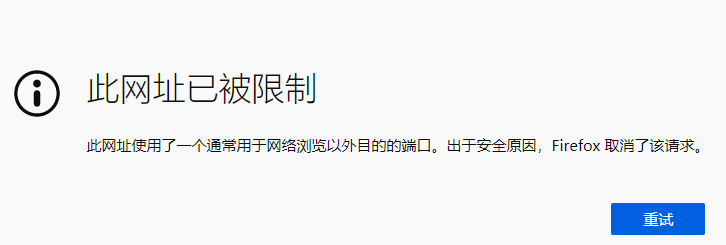

====================
 浏览器常见疑难收集
====================

此网址已被限制
==============

当使用 firefox 出现如下界面时

表示, 你当前访问的网站使用了一个特殊的端口, 出于安全考虑,
这个端口默认禁止访问

解决方法
--------

#. 在 Firefox 地址栏输入 ``about:config``

#. 右键新建一个 **字符串键**

#. **首选项名称** 填写 ``network.security.ports.banned.override``,
   值的填写有三种方式

   * 只取消一个端口号限制时, 填写对应的端口号, 如 6666

     发现这个问题时, 我使用的就是 6666

   * 取消多个端口号限制时, 端口号之间用 **,** 隔开, 如: `6666,7777,8888`

   * 一个个填写端口号太麻烦, 在保证安全的前提下, 还简化为 `0-65535`

   如果是学习, 开发环境, 推荐第3种方式, 一次输入, 以后就不会再报类似错误了

当使用 EDGE 时, 会出现 **ERR_UNSAFE_PORT** 错误提示

如何让 firefox 标签页后台打开
=============================

即打开页面, 再点击链接, 不会跳到新链接产生的 tab 页面上;

#. 地址栏输入 ``about:config``
#. 找到:
   #. ``browser.tabs.loadDivertedinbackground``
   
   #. ``browser.search.openintab`` 新标签页进行搜索

   #. ``browser.urlbar.openintab`` 新标签页打开地址

   #. ``browser.tabs.loadBookmarksInTabs`` 新标签页打开书签
      
#. 修改为 **True** 即可, 默认为 False;
   即可解决绝大多数链接在新标签页打开 ( 书签, 搜索结果, 网页上的 URL 链接等 )
